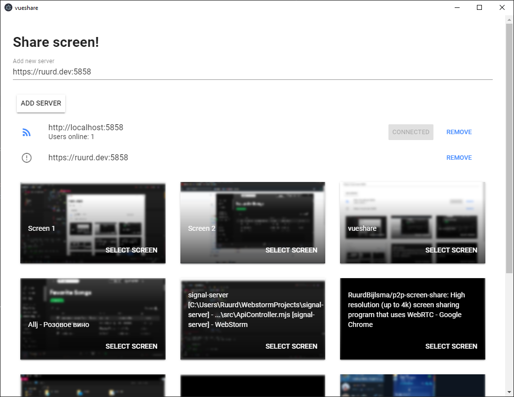
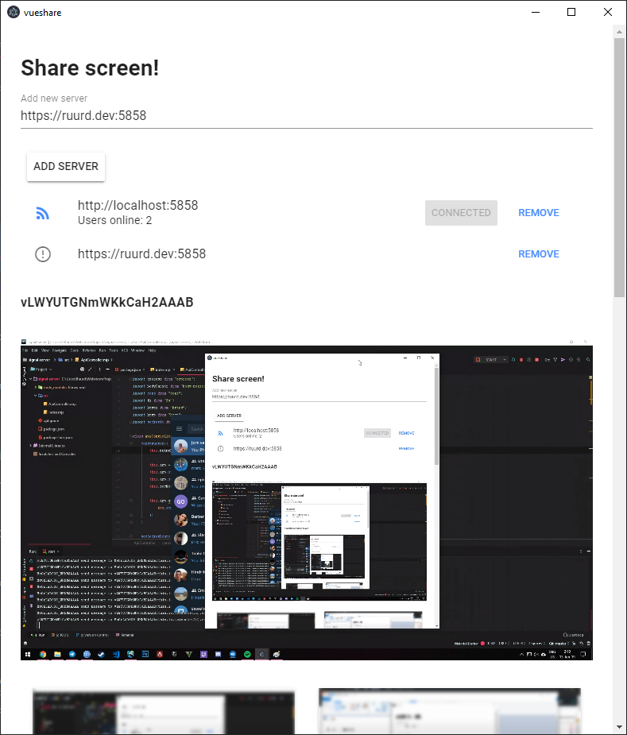

# p2p screen share
How to use:
* Have a server running, server software can be found here: https://github.com/ruurdbijlsma/signal-server
* Install the latest client release found here: https://github.com/RuurdBijlsma/p2p-screen-share/releases


### Select screen to share to people in server room:

### Watching someone else's screen stream, can be fullscreened. Audio works too, is muted by default



## Project setup
```
npm install
```

### Compiles and hot-reloads for development
```
npm run serve
```

### Compiles and minifies for production
```
npm run build
```

### Run your tests
```
npm run test
```

### Lints and fixes files
```
npm run lint
```

### Customize configuration
See [Configuration Reference](https://cli.vuejs.org/config/).
